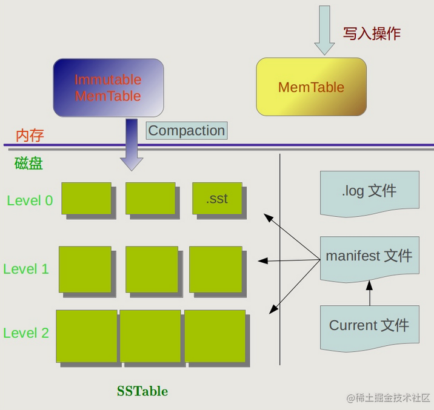

# gfs

## master

### 维护元数据
1. filename目录结构，文件目录树     --> 可持久化
树形结构，记录父亲

2. 文件名和chunk之间的映射          --> 可持久化

chunk + id --> 表示其在文件中的那个位置
文件名可以理解为一个目录 + 文件.

3. chunk所在的几个服务器位置        --> 不可持久化

chunk在变动的时候会向master进行报告。

4. chunk对应的租期在那个服务器上

```cpp
#define CHUNK_NUM 3
struct chunk{
    size_t chunkid;					// 持久化
    string position[CHUNK_NUM];		
    size_t chunkversion;			// 持久化
    string lease_server_position;
    size_t lease_absolute_time;
}
```
   
   

### 租约分配

租约分配过程，当client要写的时候，首先会向master
0. 查看当前在client缓存中的chunk的租约，如果过期了向master查询
1. master对负载较低的chunkserver分配租约

### 负载均衡chunk分配

1. 通过心跳数据得到：最近一段时间工作时长
2. 通过心跳数据得到：最近一段时间新增chunk数量


3. 通过心跳数据得到：服务器中所有chunk的位置。


### 文件写过程

受限访问master拿到写锁，然后返回，这里只给出chunk所在server的位置。返回给client，写完之后返回释放写锁。

### 目录树
使用目录树控制访问，目录树中每一个节点都有一个读写锁，每一个用户持有一定数量的锁，在一定时间内client没有和master维护心跳会自动释放。

#### 文件记录格式


使用上述格式存储一个目录树，目录树的结构就用如下方式存储：

```cpp
struct dir_tree{
    bool flag;	//	dir,file
    std::string name;
    map<string,dir_tree>node;		// 里面注意保存一个上层目录
    mute_t mute_file;	// 只有在flag == file的时候才会起作用
    // 实际上这个锁可以使用map进行使用时分配。map<string,mute_t>,然后对于每个文件检查是不是建立过锁。
    set<size_t>chunk_id;
}
```

定期任务

1. 

### 删除操作

删除一个chunk必须经过master。

### 快照生成

每一个chunk上有一个引用计数

## chunkserver

### 异常处理

**检测到异常之后，停止服务，和master进行联络，master是全局唯一的领导。**

### 维护数据

### 校验

在Google文件系统（GFS）中，校验和的计算是由ChunkServer执行的。每个ChunkServer在写入数据块到本地磁盘之前会计算校验和，并将其与数据一同存储起来。

校验和的计算过程如下：
1. ChunkServer接收到写入请求时，将数据块写入本地磁盘的同时，计算数据块的校验和。
2. 通常情况下，校验和使用强校验和算法，如CRC32或MD5，在数据块上执行。
3. 计算得到的校验和会被存储到本地磁盘上，与数据块一起保存。

当读取数据时，ChunkServer可以使用校验和来验证数据的完整性：
1. 当ChunkServer接收到读取请求时，它会将对应的数据块从本地磁盘读取出来。
2. 在返回数据之前，ChunkServer会重新计算读取的数据块的校验和。
3. 如果重新计算的校验和与存储在本地的校验和一致，那么数据被认为是完整的；否则，数据可能已被损坏或篡改。

通过在ChunkServer上计算和校验校验和，GFS可以在数据传输和存储过程中检测到数据的损坏或篡改，以确保数据的完整性。这提供了数据的可靠性保证，同时也增加了数据一致性和错误恢复的能力。

### 如何处理校验

当在Google文件系统（GFS）中检测到数据块损坏时，以下是可能的操作流程：

1. 检测和报告：当ChunkServer通过重新计算校验和发现数据块损坏时，它会将损坏的块标记为损坏或无效，并向Master报告该情况。这样，Master就可以了解到块的状态，并采取相应的措施。

2. 块的修复：GFS旨在提供数据的冗余和容错能力。因此，当一个数据块被标记为损坏时，GFS会尝试执行块修复操作。
   - Master会检查其他副本的数据块以确定哪些副本的数据是完整和可用的。
   - 如果存在其他完整的副本，GFS会选择一个健康的ChunkServer，并使用可用的副本数据来修复损坏的副本。修复过程涉及将完整的数据块复制到损坏的ChunkServer上。
   - 一旦修复完成，数据块就会恢复到正常的状态，该块就可以继续被读取和写入。

3. 块的丢失和重建：如果没有其他副本或其他副本也损坏，Master会判断该块已经丢失。在这种情况下，GFS会尝试进行数据恢复，以避免数据的永久丢失和不可用。
   - GFS会在其他ChunkServer上的冗余块中尝试找到丢失的数据块的副本。
   - 如果找到副本，GFS会将副本复制到新的ChunkServer上，以重建丢失的数据块。
   - 一旦重建完成，数据块就会恢复到正常的状态，该块就可以继续被读取和写入。

通过以上操作，GFS能够检测和处理数据损坏的情况，保证了数据的可靠性和一致性。当数据损坏时，GFS会尽量通过副本和重建操作来修复和恢复数据，以确保数据的完整性，并保持文件系统的正常运行。

### 定时任务


1. 心跳（Heartbeat）：ChunkServer会定期向Master发送心跳信号，以表明自己的存活状态。这使得Master能够检测和维护ChunkServer的健康状态，并及时处理故障。

2. 块报告（Block Report）：ChunkServer会定期向Master发送块报告，汇报自己所管理的所有块的信息，包括块的ID、位置、版本号等。这有助于Master了解ChunkServer上的数据分布情况和数据一致性检查。

3. 复制（Replication）：ChunkServer会根据Master的指示，定期执行数据复制操作。它会检测并维护块的副本数量，并在需要时将数据块复制到其他ChunkServer，以提高数据的可靠性和可用性。

4. 垃圾收集（Garbage Collection）：当文件被删除或修改时，文件系统会标记相关的块为无效。ChunkServer会定期进行垃圾收集操作，清理无效块以释放存储空间。

5. 数据处理：ChunkServer可能会定期执行一些数据处理操作，如数据压缩、加密或其他需要在数据存储层面进行的操作。

   

这些定时操作有助于GFS的稳定性和性能，确保数据的可靠性和一致性。同时，定期的通信和检查也可以帮助系统监测和修复故障，保持整个系统的正常运行状态。

### 行动
1. 心跳
    上报工作时间
    上报chunk新增数量
    上报删除chunkid
    上报新增chunkid

2. chunk维持一个版本号，为了防止chunkserver下线之后在上线chunk的数据不对，租期改变的时候就会将这个chunk的版本号都+1

3. 写数据

首先向带有leave的读写锁，

4. 读数据

    


### grpc

1. 一些chunk的创建和删除还有追加接口

## client

内部有一部分和master一样的逻辑，例如目录树，还有

#### 定时任务

每隔一段时间进行一次缓存的更新

### 进行读写


### 查找目录

## raft
对于客户端来说这是ok的，因为未提交就代表不成功，

```cpp
// 追加日志 RPC Request             
type AppendEntriesRequest struct {  
term int // 自己当前的任期号 
leaderId int //leader( 也就是自己 ) 的 ID
prevLogIndex int // 前一个日志的日志号
prevLogTerm int // 前一个日志的任期号
entire []byte // 当前日志内容
leaderCommit int// leader 的已提交日志号,用于告诉follower的日志是否可以提交，因为leader是要等到所有follower的日志全部复制完毕之后才能提交。对于那些在追赶日志进度的follower，当leadercommit > follower时候所有日志都会提交
}

// 追加日志 RPC Response
type AppendEntriesResponse struct {
    term int        // 自己当前任期号
    success bool    // 是否可以成功的加入，只有通过了一直性检查才会返回true】
}
```


### 安全性

Raft增加了如下两条限制以保证安全性：

- 拥有最新的已提交的log entry的Follower才有资格成为Leader。

这个保证是在RequestVote RPC中做的，Candidate在发送RequestVote RPC时，要带上自己的最后一条日志的term和log  index，其他节点收到消息时，如果发现自己的日志比请求中携带的更新，则拒绝投票。日志比较的原则是，如果本地的最后一条log  entry的term更大，则term大的更新，如果term一样大，则log index更大的更新。

- Leader只能推进commit index来提交当前term的已经复制到大多数服务器上的日志，旧term日志的提交要等到提交当前term的日志来间接提交（log index 小于 commit index的日志被间接提交）。

之所以要这样，是因为可能会出现已提交的日志又被覆盖的情况：


已提交的日志被覆盖

在阶段a，term为2，S1是Leader，且S1写入日志（term, index）为(2, 2)，并且日志被同步写入了S2；

在阶段b，S1离线，触发一次新的选主，此时S5被选为新的Leader，此时系统term为3，且写入了日志（term, index）为（3， 2）;

S5尚未将日志推送到Followers就离线了，进而触发了一次新的选主，而之前离线的S1经过重新上线后被选中变成Leader，此时系统term为4，此时S1会将自己的日志同步到Followers，按照上图就是将日志（2， 2）同步到了S3，而此时由于该日志已经被同步到了多数节点（S1, S2, S3），因此，此时日志（2，2）可以被提交了。；

在阶段d，S1又下线了，触发一次选主，而S5有可能被选为新的Leader（这是因为S5可以满足作为主的一切条件：1. term = 5 > 4，2.  最新的日志为（3，2），比大多数节点（如S2/S3/S4的日志都新），然后S5会将自己的日志更新到Followers，于是S2、S3中已经被提交的日志（2，2）被截断了。

增加上述限制后，即使日志（2，2）已经被大多数节点（S1、S2、S3）确认了，但是它不能被提交，因为它是来自之前term（2）的日志，直到S1在当前term（4）产生的日志（4，  4）被大多数Followers确认，S1方可提交日志（4，4）这条日志，当然，根据Raft定义，（4，4）之前的所有日志也会被提交。此时即使S1再下线，重新选主时S5不可能成为Leader，因为它没有包含大多数节点已经拥有的日志（4，4）。


### 集群成员变更

#### 脑裂问题

在需要改变集群配置的时候(如增减节点、替换宕机的机器或者改变复制的程度)，Raft可以进行配置变更自动化。

但是由于参数变化需要一些时间，例如从三节点变为5节点，变化的时候老的三节点中有两个还是老配置，任务服务器数量为3，另一个为新配置，认为集群数量为5，这样5个服务器中，有两个服务器可以通过收到$floor(3 / 2) = 2$票当选leader，另外两个可以通过floor(5 / 2) = 3票当选leader，于是就有可能出现两个leader。

raft采用了两阶段算法，这个不看，太难了


## grpc通讯

# 一些问题
## 分布式相关
### 1. 写流程
- client首先根据写的位置计算偏置。
- 将写的数据分为几个chunk。
- 如果master有当前写位置的chunk，client向master拿到文件的写锁，并且得到租约服务器以及其他服务器的位置，如果没有写位置的chunk，那么将根据负载均衡分配chunk,但此时master并不会修改元数据。因为写入可能不成功。
- 向最近的一个chunkserver传输数据。
- 向持有租约的chunkserver发送写信号。
- chunkserver开始写
- 当chunkserver都写完时会将写完成操作传给持有租约的chunkserver
- 持有租约的chunkserver收到写完的操作会认为写操作完成
- 将写完成给master发送(数据写成功后发送给master，防止master写日志前chunk还不存在，导致不一致的问题，而且master中日志适用于维护元数据的，chunkserver中没有写入成功，元数据就不能改变)，master日志写成功之后会返回给chunkserver，
- chunkserver返回给客户端写成功。全部文件写成功之后将锁释放，将定时器属于用户的定时器删除。

### 2. 读流程

- client计算文件的偏移，得到要读取的位置。（不是chunk）
- client向master拿到文件的读锁，得到读锁之后向任意一个chunkserver发起读请求
- 由于过程中没有修改元数据，所以不涉及master日志的问题。

### 3. 如何进行负载均衡

- 在近期写入最少得位置增加新的chunk（如果当前位置放不下就放在下一个近期新增最少得服务器中）
- 在存储较少的位置写入chunk

- 在一些空闲的时间将chunk较多的server数据搬移到较少的位置，这种迁移不叫数据的新加入。
- 成功后写入master日志。

### 4. 如何添加一个新的chunkserver，添加一个chunkserver之后会发生什么

新加入的chunkserver会给master发送心跳，master感知到之后会修改元数据，然后就算将chunkserver加入了，之后在空闲时期会将chunkserver进行均衡处理。

### 5. master/chunkserver宕机执行流程

chunkserver宕机之后，master会感知到，chunkserver上的数据就会复制到其他位置。同时转移的过程依旧会维护宕机chunkserver元数据，防止突然chunkserver上线。
master宕机之后，会由raft保证master的高可用，raft中follower在一段时间内没有接收到心跳之后会将自身状态转换为candidate并投自己一票，进行选举，向其他follower发送选票，拥有最大任期号和序号日志的candidate，并且得票超过半数才有资格当选leader，否则就会进行下一轮选举，为了防止这种情况不断地循环，follower和candiate的超时时间是随机的。

### 5. master/chunkserver恢复之后执行任务流

master恢复之后会因为leader不断地和他通讯之后会将日志重做到恢复之后的master上面，最终使得一致性得到保证（使用raft保证一致性）
chunkserver恢复之后会向master发送心跳，并向其发送一些需要更新的chunk（主要是恢复之后的这段时间的更新），以及需要删除的chunk，chunkserver进行执行，直到恢复完毕，chunkserver才能进行接下来的服务。
chunkserver宕机的时间，master会保存元数据一段时间，一段时间之后会将chunk副本陆续的复制到其他位置，这期间发生的写操作会将chunk进行转移。同时会将宕机的元数据进行标记，后续再chunkserver重启后将标记的chunk删除。

### 6. 为什么底层使用leveldb

因为底层使用leveldb会使得写的效率增加，leveldb在memtable满了之后会转为immutable memtable，immutable memtable会追加到level0，在level0会在闲时合并到level1，层层合并，因为在闲时合并，所以维护查找性能的操作分摊在了其他时间。对于删除操作一般都是在memstable中添加一项，在后续的操作中会因为合并将删除执行，效率会很高。

### 7. 租约目的是什么，如何维护
租约依据当前chunkserver的工作情况和租约在三个chunkserver中的分配情况来处理写操作。
租约是用来分担master写操作压力的，使得数据流不会经过master。同时做到一个负载均衡，使得写操作不会全部挤在一个chunkserver中。
租约有一个过期时间，是为了防止出现两个有租约的服务器（脑裂,没有缓存的client可能不会出现这个问题）。一个含有租约的chunkserver

### 8. 如何进行垃圾回收

垃圾回收一般会发生在chunkserver宕机，client主动删除，数据完整性检查，这几个部分。master会标记元数据，并在请求不是很多的时候进行垃圾处理。
chunkserver宕机之后，可能客户端会产生写操作，这时因为写流程要求强一致性，一台chunkserver无法保证写成功那么就会做异常处理。

### 9. chunkserver高可用是如何维护的
使用多个chunk副本，系统中至少保存了三个副本，当一个chunkserver宕机之后，其他chunkserver还会保存宕机chunkserver中的副本。

### 10. 快照如何工作的
快照主要依靠引用和写时复制来完成的。新建一个快照文件，其中对应的chunk\_id和原文件一样，同时将chunk的引用计数+1，当原文件被写的时候直接复制一个chunk，然后再新的chunk上面修改。

### 11. 读写锁锁机制怎么实现
锁的最小单位是文件,而不是一个chunk。
读写锁需要向master去申请，获取到锁之后master返回，完成读写操作之后，无论成功还是失败都会将锁释放。
读写锁中要有个超时逻辑，锁的维持使用的是客户端与服务端的心跳，每一次心跳都在超时时间之前的较长一段时间（防止失误发生锁的错误释放），直到客户端持有的锁主动释放。超时释放也有条件。

### 12. 目录树怎么实现与存储
1. 文件中如何将目录存储，可以转换为如何将树结构表示出来。
- 文件中记录当前节点有多少子，一个节点下面给出子的数量，之后递归进行加载树的结构。
2. 有了树结构之后如何进行保存。
- 于是保存树结构也可以使用递归的结构,遍历树的方式使用先序遍历。
3. 内存中存储的方法。
- 使用map进行保存。一个节点中会有一个map，节点类型，节点名称，其中的map会指向多个节点。

### 13. 多用户怎样实现
grpc会自动产生多线程，多个请求的问题交给grpc，但是内部chunkserver是实现有一个线程池，因为最终要实现流水线写，需要一个线程池用来将多用户的流水下写传下去。
### 14. ops
5MB/s，阿里云服务器开了6台2核4G服务器，60G大小磁盘，吞吐量直接跑满。

### 15 master日志问题

用于记录元数据改变。一般是先记日志，后改变元数据。现将日志复制到大部分follower中，大部分节点复制成功之后leader提交，然后leader通知follower提交。

### 16 master宕机后如何进行回复

这个是raft需要做的事，raft中leader会不断给宕机的follower发送心跳，当follower重启之后会将日志重新写一份

### 17 raft如何保证一致性

raft 主要根据日志来保证元数据一致性看，日志提交后，元数据就算修改了（所以逻辑一定是先修改元数据，再提交日志）。

### 18 如何选择租约所在服务器

- 通过三个副本当前租约持有数。分给最少得那个

### 19 写失败如何进行

- 多次尝试之后一直失败，如果是发生chunkserver掉线，则将这个chunk在其他位置复制过去，在其他位置修改，如果是其他原因进行相应的其他处理。之后再宕机chunkserver恢复之后会将其中的无效chunk进行垃圾回收。

### 20 master中需要多线程的地方
1. 定时器的执行需要多线程，如垃圾回收，定期负载均衡，需要一些线程

### 21 哪里需要定时器,如何实现
1. chunk的锁
2. 垃圾回收
3. 定时发送心跳（不用定时器，这里多开几个线程使用阻塞方式while循环发送心跳）
4. 定期负载均衡

主要是使用了小顶堆，因为这里有一些定时器需要进行时间修改(chunk锁)，所以要考虑修改后如何进行调整(时间变大向下调整，因为可能其与子不满足堆性质，时间变小向上调整，因为其可能与父不满足堆性质)，调整结束之后重置定时器，因为只有在堆性质成立之后，定时器才能工作。

客户端主动释放chunk锁时需要将定时器中相关事件时间调成当前时间，调整定时器，令其执行函数。

### 22 master中日志作用是什么
master中日志主要作用是用来维护元数据，与数据库中日志不同，其无法用于恢复chunk中的数据，而是用来恢复master中的元数据的。chunk的高可用主要依靠chunkserver中的副本。


## leveldb相关
### 1. 底层存储为什么用leveldb

因为leveldb存储消耗比较小，支持LSTM顺序写；

#### 什么是LSMT

##### 1. 由两部分组成：

 1. SStable：

    SSTable的全称是 **Sorted String Table** ，本质就是一个KV结构顺序排列的文件，需要注意，SSTable是不可修改的，我们只会用新的SSTable去覆盖旧的，而不会在原本的基础上修改。 因为修改会涉及随机读写，这是我们不希望的。

    

    最基础的SSTable就是上图当中右侧的部分，即key和value的键值对按照key值的大小排序，并存储在文件当中。  当我们需要查找某个key值对应的数据的时候，我们 **会将整个文件读入进内存** ，进行查找。  同样，写入也是如此，我们会将插入的操作在内存中进行，得到结果之后，直接覆盖原本的文件，而不会在文件当中修改，因为这会牵扯到移动大量的数据。

    如果文件中的数据量过大，我们需要另外建立一个 **索引文件** ，存储不同的key值对应的offset，方便我们在读取文件的时候快速查找到我们想要查找的文件。 索引文件即上图当中左边部分。  

 2. memtable

    Memtable顾名思义就是 **存放在内存当中的表结构** 。 当然也不一定是表结构，也可以是树结构，这并不影响，总之是一个可以快速增删改查的数据结构，比如红黑树、SkipList都行。
    
##### 2. 查找过程：

##### 他首先查找在内存中的memtable，如果没有查到的话就查找SStable，先将SStable读入到内存中，然后使用二分查找快速找到，因为SStable要一个一个找，所以可以在每个SStable前面加一个布隆过滤器，判断一个元素是否可能在SStable中。


##### 3. 增删改过程

除了查找之外的其他操作都发生在Memtable当中，比如当我们要 **增加一个元素的时候，我们直接增加在Memtable** ，而不是写入文件。 这也保证了增加的速度可以做到非常快。  

除此之外，修改和删除也一样，如果需要修改的元素刚好在Memtable当中，没什么好说的我们直接进行修改。 那如果不在Memtable当中，如果我们要先查找到再去修改免不了需要进行磁盘读写，这会消耗大量资源。  所以我们还是在Memtable当中进行操作，我们会插入这个元素，标记成修改或者是删除。    

**当Memstable比较大的时候就要将其落盘为SStable，我们定期将Memstable落盘，这就是SStable的由来。**

我们需要定期将所有的SSTable合并，在合并的过程当中我们完成数据的删除以及修改工作。 换句话说，之前的删除、修改操作只是被记录了下来，直到合并的时候才真正执行。 

#### leveldb是怎样工作的 



其中的ImmuTable MemTable是不可修改的memtable是在memstable转化为sstable时的一个中间状态，当需要转化的时候，memstable需要先转化为immutable memtable，然后新生成一个memstable维持业务。

leveldb还维护了关于sstable表中key最大最小值的信息，放在了manifest中


有了这张表，在读取的时候可以进行优化。

###### leveldb为什么有多个级别

我问了chatgpt，然后看了一篇知乎，明白了他这个是咋个回事。

[leveldb为什么要设计为多层结构呢？ - kmalloc的回答 - 知乎 ](https://www.zhihu.com/question/396452321/answer/1245860938)

```
1. leveldb为什么设置好几个level
主要是为了合并用的，leveldb将一个level中sstable划分为key取值区间互不相交，如果是只有一个level0的话，那么memtable在存满之后和level0中的sstable进行合并的代价会非常大，因为一个level0中得sstable会非常多，于是作者就搞了好多level，让他们一级一级进行合并，但是这个合并不是在一个时间内进行的，也就是说，最开始只是memtable追加到level0（level0中sstable是可能相交的，因为要使用追加操作），然后隔一段时间才会有level0合并到level1.....就是有一些延迟的操作。
2. level0中sstable是否是有序的
是有序的，两个sstable之间的键值最值区间是不相交的。
3. level0是sstablekey区间是不相交的吗，如果是不相交地，那么如何保证插入的时候会有大量的追加。
实际上level0中sstable是无法保证区间不相交的，所以就能使用追加了，只有其他级别保证key不相交。
```


```
leveldb 为什么使用多层结构
作者：dwing
链接：https://www.zhihu.com/question/396452321/answer/1245248796
来源：知乎
著作权归作者所有。商业转载请联系作者获得授权，非商业转载请注明出处。

LevelDB的设计很面向实际工程, 它的设计方案来源于这几个实际需求:
1. 对写入性能要求高, 而读性能是次要的. 可能很多人对此表示不理解, 认为现实环境中读的次数远多于写的次数. 这是他们对LevelDB所在的层次有所误解. LevelDB是个最底层的存储库, 而大多数读数据应该在上层的cache中获取, 不应该过于依赖LevelDB本身的读操作(虽然其本身有一定程度的cache支持), 另外对于查找不存在的记录确实每次都会访问到LevelDB, 不过通过适当配置的bloom filter可以避免绝大部分磁盘读操作. 而写操作就不一样了, 上层的写操作要频繁地落实到LevelDB上, 否则断电就会丢掉刚写入的数据. 因此可以看出, 在LevelDB这个层次来看, 正常用法是写操作多于读操作的.
2. 数据库虽庞大, 但根据80/20定律, 只有少部分数据会频繁读写. LevelDB的分层就是解决此问题而设计的, 冷热数据很容易分到不同的层次, 位于低层的少部分热数据文件的访问会快很多, 位于高层的大量冷数据大部分时间都在磁盘里静静地躺着, 顺带增量备份也容易实现.
3. 数据写入经常是间歇突发的. 数据库的访问经常是不稳定的, 为了削峰填谷, LevelDB在写入时只做了最有必要的操作就返回了成功, 即顺序附加到log文件并更新内存中的memtable. 当然数据库仅靠这样的操作无法高效访问数据, 所以利用没有数据访问期间的空闲时间, 用后台线程慢慢整理数据. 既让每次操作看起来很快, 也能充分利用空闲的CPU和IO改进整体性能, 符合多核CPU时代的设计理念. 当然整理也分优先级的, 这也是分多层设计的原因之一.
```

总结来说就是为了维护level中stable的key值域不相交，分摊整合sstable的过程。

##### leveldb的读取


读取过程首先会查找Memtable和immutable Memtable，（immutable Memtable 会在一段时间后才会被写到磁盘中，所以当前还可以进行查看），如果没有在memtable中查找到，则在manifest中查找key可能出现在那个sstable上，一个level中的sstable的key区间是不想交的，对于同一个key来说，**可能同时出现在不同level的SSTable当中**，但是由于leveldb在写入SSTable的时候遵循越晚写入的数据越新的原则。也就是说**level序号越小的数据越新**，所以如果找到了多个值，那么优先返回上层的结果。我们可以将manifest缓存在内存当中，这样可以减少读取manifest文件的时间，起到加速的作用。但是同时，也带来了维护缓存的成本。


##### leveldb的增删改

leveldb当中的**写、删、改操作和裸的LSMT基本一样**，分成以下几个步骤。

首先，会将变更的数据写入.log文件当中。这是为了持久化数据，放置系统宕机导致数据丢失。

当写入.log文件成功之后，写入MemTable。由于leveldb中的MemTable采用SkipList实现，所以写入速度也会很快，大约是)的复杂度。如果MemTable容量达到或者超过阈值，会触发进一步写入SSTable的操作。在这个写入当中，首先会将MemTable转化成Immutable MemTable，之后会新建一个空的MemTable应对后续的请求，当dump指令下达之后，会将Immutable MemTable写入成SSTable文件进行存储。


作者：梁唐
链接：https://juejin.cn/post/6844904105110929416
来源：稀土掘金
著作权归作者所有。商业转载请联系作者获得授权，非商业转载请注明出处。


##### leveldb的level，sstable压缩操作

levelDb采取了compaction的方式来对已有的记录进行整理压缩，通过这种方式，来删除掉一些不再有效的KV数据，减小数据规模，减少文件数量等。

压缩操作有两种minor ，major

1. minor Compaction，就是把memtable中的数据导出到SSTable文件中；

   immutable memtable其实是一个SkipList，其中的记录是根据key有序排列的，遍历key并依次写入一个level 0 的新建SSTable文件中，写完后建立文件的index 数据，这样就完成了一次minor compaction。

   从图中也可以看出，对于被删除的记录，在minor  compaction过程中并不真正删除这个记录，原因也很简单，这里只知道要删掉key记录，但是这个KV数据在哪里？那需要复杂的查找，所以在minor  compaction的时候并不做删除，只是将这个key作为一个记录写入文件中，至于真正的删除操作，在以后更高层级的compaction中会去做。


2. major compaction就是合并不同层级的SSTable文件；

	当某个level下的SSTable文件数目超过一定设置值后，levelDb会从这个level的SSTable中选择一个文件（level>0），将其和高一层级的level+1的SSTable文件合并，这就是major compaction。

	大于0的层级中，每个SSTable文件内的Key都是由小到大有序存储的，而且不同文件之间的key范围（文件内最小key和最大key之间）不会有任何重叠。Level 0的SSTable文件有些特殊，尽管每个文件也是根据Key由小到大排列，但是因为level 0的文件是通过minor  compaction直接生成的，所以任意两个level 0下的两个sstable文件可能再key范围上有重叠。所以在做major  compaction的时候，对于大于level 0的层级，选择其中一个文件就行，但是对于level  0来说，指定某个文件后，本level中很可能有其他SSTable文件的key范围和这个文件有重叠，这种情况下，要找出所有有重叠的文件和level 1的文件进行合并，即level 0在进行文件选择的时候，可能会有多个文件参与major compaction。

### 2. 为什么leader不删除未提交的日志，而是提交他

因为很有可能日志已经提交了，但是leader再向follower通知的时候发生了宕机，导致follower日志没有提交


# 脑裂问题原因

主要是为了防止多个客户端对两个持有租约的datanode进行操作。

```markdown
chatgpt:

租约也可能导致脑裂问题。当一个节点获取了租约后发生网络分区，该节点无法与其他节点进行通信，而其他节点可能会认为该节点已经失去了联系。在这种情况下，其他节点会尝试重新分配租约，把原本持有租约的节点视为不可用。

这种情况下，如果网络分区解决后，原本持有租约的节点与其他节点恢复通信，可能会发生多个节点持有相同租约的情况。这可能导致数据的多次修改和不一致性，**因为不同节点会同时尝试执行针对同一份数据的操作**。

为了避免租约导致的脑裂问题，分布式系统需要在租约超时或网络分区解决后的恢复期间执行一些特定的操作。例如，可以进行冲突检测和解决，以确保最终只有一个节点持有租约，并且数据的修改操作得以正确执行和同步。这样可以确保数据的一致性和正确性。
```

这个和我的想法是一致的例如下图：

假如master在处理没有租约的情况是这样的，就是立即分配租约。

最开始s1有租约，c1,c2缓存中认为s1有租约。


然后s1突然网络拉胯，然后c2开始发出写操作，发现s1掉了，然后就去问master，master给s2分配了一个租约


突然S1网络好使，但是这个时候c1开始写，首先检查缓存中**s1租期还没有到**，然后就向s1发送写请求，他发现还能写进去，然后就乱套了.


这个时候对于s1和s2的数据他是不一样的。

**当然出现这种情况的只能是在网络不好的情况下，如果是挂掉导致这种情况是不可能的，因为服务器挂掉之后可以直接先停止服务，听从master分配**


# 目录树的锁


# grpc使用


|.proto type|c++|notes|
|---|---|---|
|double|double| |
|float|float| |
|int32|int32|使用可变长编码方式，负数时不够高效，应该使用sint32|
|int64|int64|同上|
|uint32|uint32|使用可变长编码方式|
|uint64|uint64|同上|
|sint32|int32|使用可变长编码方式，有符号的整型值，编码时比通常的int32高效|
|sint64|sint64|同上|
|fixed32|uint32|总是4个字节，如果数值总是比2^28大的话，这个类型会比uint32高效|
|fixed64|uint64|总是8个字节，如果数值总是比2^56大的话，这个类型会比uint64高效|
|sfixed32|int32|总是4个字节|
|sfixed64|int64|总是8个字节|
|bool|bool| |
|string|string|一个字符串必须是utf-8编码或者7-bit的ascii编码的文本|
|bytes|string|可能包含任意顺序的字节数据|
[bytes使用参考](https://cloud.tencent.com/developer/article/1946885)
[表格来源](https://blog.csdn.net/wangchong_fly/article/details/47614699)

1. 每一个grpc请求要重新定义一个ClientContext context传进去，不然会报错。
```cpp
    ChunkServer::VoidMessage void_message;
    ChunkServer::HeartBeat heartBeat;
    ClientContext context;  // 一个grpc请求对应一个，每个请求加都要重新申请新的
    Status st = stub_->get_heartbeat(&context, void_message,&heartBeat);
```

2. repeat字段表示的是一个数组，直接使用"add_字段名(参数)"就能将参数加入数组
```proto

message HeartBeat{
  int32 worktimes = 1;
  int32 chunkaddcount = 2;
  repeated int64 chunkaddlist = 3;
  repeated int64 chunkdellist = 4;
}
```
```cpp
Status Chunk::get_heartbeat(ServerContext *context, const ChunkServer::VoidMessage *voidmessage, ChunkServer::HeartBeat *heartbeat){
    heartbeat->set_worktimes(10);
    heartbeat->set_chunkaddcount(11);
    heartbeat->add_chunkaddlist(12);
    heartbeat->add_chunkaddlist(13);
    heartbeat->add_chunkaddlist(14);
    heartbeat->add_chunkdellist(12);
    return Status::OK;
}

```
[编译方法](https://zhuanlan.zhihu.com/p/368157903)


# Rpc简介

## 为什么使用rpc

rpc的作用就是让远程调用方法更方便，一些服务需要通过调用其他服务器上的函数执行，不是本地的函数，如果手动写一个方法需要考虑很多，如底层传输和序列化等问题，使用rpc框架可以讲这些事情简化。

## rpc简介

1. **服务消费端（client）**以本地调用的方式调用远程服务；
2. **客户端 Stub（桩）**：这其实就是一代理类。代理类主要做的事情很简单，就是把调用方法、类、方法参数等信息序列化传递到服务端。
3. **网络传输**：网络传输就是要把调用的方法的信息比如说参数啊这些东西传输到服务端，然后服务端执行完之后再把返回结果通过网络传输给你传输回来。网络传输的实现方式有很多种比如最基本的 Socket 或者性能以及封装更加优秀的 Netty（推荐）。
4. **服务端 Stub（桩）**：这个桩就不是代理类了。我觉得理解为桩实际不太好，大家注意一下就好。这里的服务端 Stub 实际指的就是接收到客户端执行方法的请求后，去执行对应的方法然后返回结果给客户端的类。
4. **服务端（服务提供端）**：提供远程方法的一端。


1. 服务消费端（client）以本地调用的方式调用远程服务；
2. 客户端 Stub（client stub） 接收到调用后负责将方法、参数等组装成能够进行网络传输的消息体（序列化）：`RpcRequest`；
3. 客户端 Stub（client stub） 找到远程服务的地址，并将消息发送到服务提供端；
4. 服务端 Stub（桩）收到消息将消息反序列化为 Java 对象: `RpcRequest`；
5. 服务端 Stub（桩）根据`RpcRequest`中的类、方法、方法参数等信息调用本地的方法；
6. 服务端 Stub（桩）得到方法执行结果并将组装成能够进行网络传输的消息体：`RpcResponse`（序列化）发送至消费方；
7. 客户端 Stub（client stub）接收到消息并将消息反序列化为 Java 对象:`RpcResponse` ，这样也就得到了最终结果。over!

## gRPC

 Google 开源的一个高性能、通用的开源 RPC 框架。其由主要面向移动应用开发并基于 HTTP/2 协议标准而设计（支持双向流、消息头压缩等功能，更加节省带宽），基于 ProtoBuf 序列化协议开发，并且支持众多开发语言。

**何谓 ProtoBuf？** [ProtoBuf（ Protocol Buffer）](https://github.com/protocolbuffers/protobuf)

 是一种更加灵活、高效的数据格式，可用于通讯协议、数据存储等领域，基本支持所有主流编程语言且与平台无关，可以通过 ProtoBuf 定义接口和数据类型


## 有了http为什么还用rpc
1. 首先绝对不能使用裸tcp，因为这样会出现粘包，所以为了解决粘包，tcp上层必须要有一个协议；
2. rpc会对消息进行压缩，rpc要早于http，优于http1.0
3. http2.0在http1.1基础上做了优化，但是由于历史原因，一些公司使用了rpc，所以就很难将其取代了，其实grpc底层就是使用http2.1


# CAP和BASE

## CAP为什么不能同时满足
这三个特性分别是一致性、可用性、分区容错性。
一致性就是所有节点数据一致，都是最新的。
可用性，就是每次请求都保证可用，但是未必是最新的状态。
分区容错性，允许一个节点向另一个节点发送的数据丢失，就是允许网络出现故障。
为什么不能同时满足。
首先我们无法保证网络不出现问题，必须满足分区容错性。
但是如果满足一致性，就无法满足可用性，因为网络或者节点宕机原因，在分布式系统中未满足一致性就不能被使用。
如果满足可用性就不能满足一致性，还是因为网络故障，如果保证可用性，不然会有一段时间不满足一致性。

要一致性还是要可用性需要看任务
有些系统中一致性是本质要求的必须保证一致性，否则保证可用性就可以了。

## BASE理论
CAP 不可能同时满足，而分区容错是对于分布式系统而言，是必须的。为了能同时实现cap，出现了base理论。

1. ba 基本可用
在系统出现故障之后，相较于正常而言出现一些性能或者功能上的一些损失。但是不等价系统不可用。

    基本可用是指分布式系统在出现不可预知故障的时候，允许损失部分可用性。但是，这绝不等价于系统不可用。什么叫允许损失部分可用性呢？响应时间上的损失: 正常情况下，处理用户请求需要 0.5s 返回结果，但是由于系统出现故障，处理用户请求的时间变为 3 s。系统功能上的损失：正常情况下，用户可以使用系统的全部功能，但是由于系统访问量突然剧增，系统的部分非核心功能无法使用。

2. 软状态

允许系统出现中间状态，也就是cap中的数据不一致状态，认为该状态不影响系统的整体可用性。多个节点中的数据同步存在延时

3. 最终一致性

最终一致性强调的是系统中所有的数据副本，在经过一段时间的同步后，最终能够达到一个一致的状态。因此，最终一致性的本质是需要系统保证最终数据能够达到一致，而不需要实时保证系统数据的强一致性。


分布式一致性的 3 种级别：
- 强一致性：系统写入了什么，读出来的就是什么。
- 弱一致性：不一定可以读取到最新写入的值，也不保证多少时间之后读取到的数据是最新的，只是会尽量保证某个时刻达到数据一致的状态。
- 最终一致性：弱一致性的升级版，系统会保证在一定时间内达到数据一致的状态。
业界比较推崇是最终一致性级别，但是某些对数据一致要求十分严格的场景比如银行转账还是要保证强一致性。

